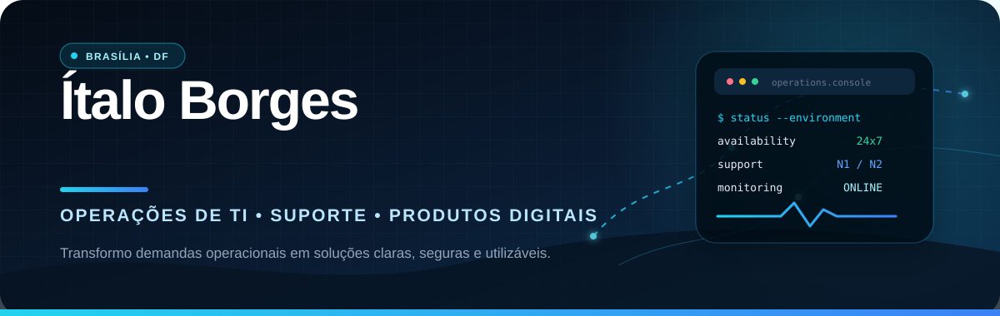
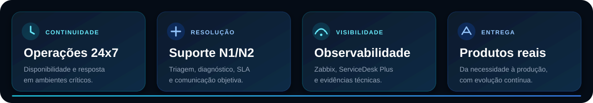
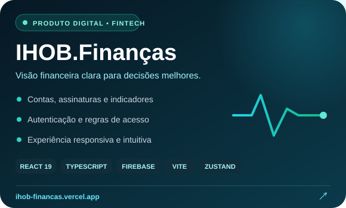
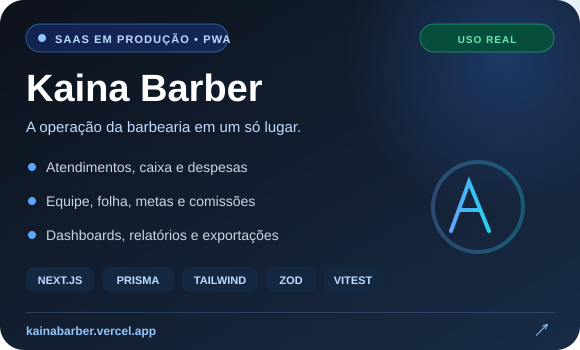

 

## Tecnologia com contexto operacional

Atuo como **Técnico de Operações de TI na Inframerica, no Aeroporto Internacional de Brasília**, sustentando um ambiente 24x7 em que disponibilidade, resposta rápida e comunicação clara fazem parte da rotina.

Minha experiência combina **suporte N1/N2, monitoramento, infraestrutura e gestão de incidentes** com a capacidade de projetar e entregar soluções digitais completas. Entendo o problema na operação, organizo a regra de negócio e transformo a necessidade em uma ferramenta utilizável.

 

## Produtos que saíram do papel

  
  

<table>
<tr>
<td width="50%" valign="top">
<h3>IHOB.Finanças</h3>

Plataforma de gestão financeira criada para oferecer uma visão centralizada de contas, assinaturas e indicadores. O produto reúne interface responsiva, persistência de dados, autenticação e regras de acesso.

<strong>Construído com:</strong> React 19, TypeScript, Vite, Firebase, Zustand, Dexie e Framer Motion.

<a href="https://ihob-financas.vercel.app"><strong>Abrir demonstração →</strong></a>

</td>
<td width="50%" valign="top">
<h3>Kaina Barber</h3>

Sistema de gerenciamento de barbearias finalizado e utilizado em operações reais por gestores do segmento. Centraliza atendimentos, caixa, despesas, equipe, folha, metas, comissões e relatórios.

<strong>Construído com:</strong> Next.js, TypeScript, Prisma, Tailwind CSS, Zod, Recharts, Vitest e Vercel.

<a href="https://kainabarber.vercel.app"><strong>Abrir demonstração →</strong></a>

</td>
</tr>
</table>

## Onde entrego valor

<table>
<tr>
<td width="33%" valign="top">
<h3>🛰️ Operações & suporte</h3>

Triagem, diagnóstico, evidências, escalonamento, acompanhamento de SLA, passagem de turno e atendimento remoto.

</td>
<td width="33%" valign="top">
<h3>🧭 Infraestrutura</h3>

Zabbix, ServiceDesk Plus, Active Directory, Windows, redes, Wi-Fi/VPN, telefonia IP, FileZilla e SFTP.

</td>
<td width="33%" valign="top">
<h3>⚙️ Produto & automação</h3>

Mapeamento de processos, regras de negócio, dashboards, relatórios, Excel/VBA e desenvolvimento full stack.

</td>
</tr>
</table>

## Stack usada para resolver

### Desenvolvimento

### Operação, suporte e dados

## Automação aplicada à rotina

### Controle de Ordens de Serviço

Solução em **Excel e VBA** desenvolvida para organizar Ordens de Serviço preventivas e corretivas, facilitar o acompanhamento de status e reduzir consultas manuais e retrabalho.

## Formação e certificações

| Formação | Certificações e estudos |
|---|---|
| **Tecnólogo em Gestão da Tecnologia da Informação** — Faculdade Senac-DF | Scrum Foundation — CertiProf |
| Experiência prática em operações, suporte e produtos digitais | Networking Basics — Cisco |
| Desenvolvimento contínuo em tecnologia e processos | Endpoint Security e Python Essentials 1 — Cisco |

 

